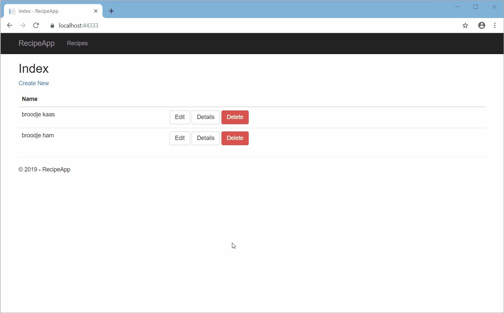

# Recipe App MVC Application

This is the second itteration of this FreeCodeCamp [challenge](https://www.freecodecamp.org/challenges/build-a-recipe-box) I created. It is made in .Net core MVC with bootstrap.

## Demo

See a demo of the application in the image below.

